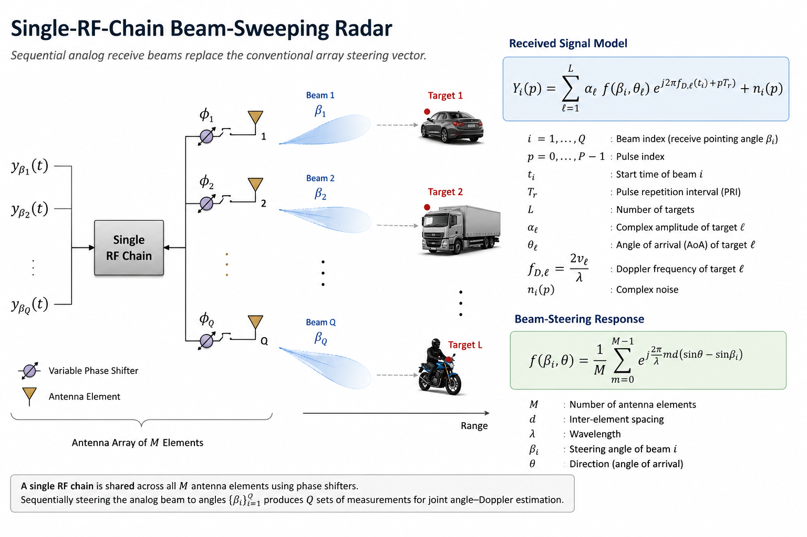

# Single-RF-Chain Beam-Sweeping Radar for Joint Angle-Doppler Estimation

This repository presents a MATLAB implementation of a **single-RF-chain beam-sweeping radar** for joint angle-Doppler estimation.

Unlike conventional  array processing, where target angle estimation is performed using the **array steering vector**, this implementation replaces the steering vector with the **beam-steering response** associated with sequential analog receive beams. The received beam-pulse measurements are then processed using a **joint angle-Doppler matched filter** that explicitly accounts for the sequential beam acquisition times, enabling coherent estimation of target angle and Doppler (or radial velocity).

---

## Features

- Single-RF-chain sequential analog receive beam sweeping.
- Beam-steering response replaces the conventional array steering vector for angle estimation.
- Full joint angle-Doppler matched filtering using the complete beam-pulse measurement matrix.
- Explicit compensation for sequential beam acquisition time.
- Multiple-target simulation with additive white Gaussian noise (AWGN).
- Angle-Doppler and angle-velocity visualization.

---

## Repository Structure

```
single-rf-radar-beam-sweeping/
│
├── run_beamsweep_demo.m
├── default_parameters.m
├── simulate_beam_sweep.m
├── ula_beamsteering_response.m
├── joint_angle_doppler_match.m
├── plot_joint_maps.m
├── display_parameters.m
├── README.md
└── LICENSE
```

---

## Running the Simulation

Open MATLAB in the project folder and run

```matlab
run_beamsweep_demo
```

The script will

- Generate the beam-sweeping measurement matrix.
- Simulate multiple moving targets.
- Perform joint angle-Doppler matched filtering.
- Display the estimated angle-velocity map.
- Display the 3-D joint angle-Doppler search surface.
- Print the simulation parameters in the MATLAB command window.

---


## Signal Model


## System Overview

<p align="center">
  
</p>

<p align="center">
<b>Figure 1.</b> Single-RF-chain beam-sweeping radar architecture and signal model.
</p>

The received signal for the *i*-th receive beam and *p*-th pulse is

\[
Y_i(p)=\sum_{\ell=1}^{L}
\alpha_\ell
f(\beta_i,\theta_\ell)
e^{j2\pi f_{D,\ell}(t_i+pT_r)}
+n_i(p),
\]

where

- \(f(\beta_i,\theta)\) is the **beam-steering response**, replacing the conventional array steering vector for angle estimation,
- \(t_i=(i-1)PT_r\) is the start time of the \(i\)-th receive beam,
- \(f_D\) is the Doppler frequency,
- \(P\) is the number of pulses collected for each beam.


## Example Results

### Joint Angle-Doppler Surface


### Joint Angle-Velocity Map


