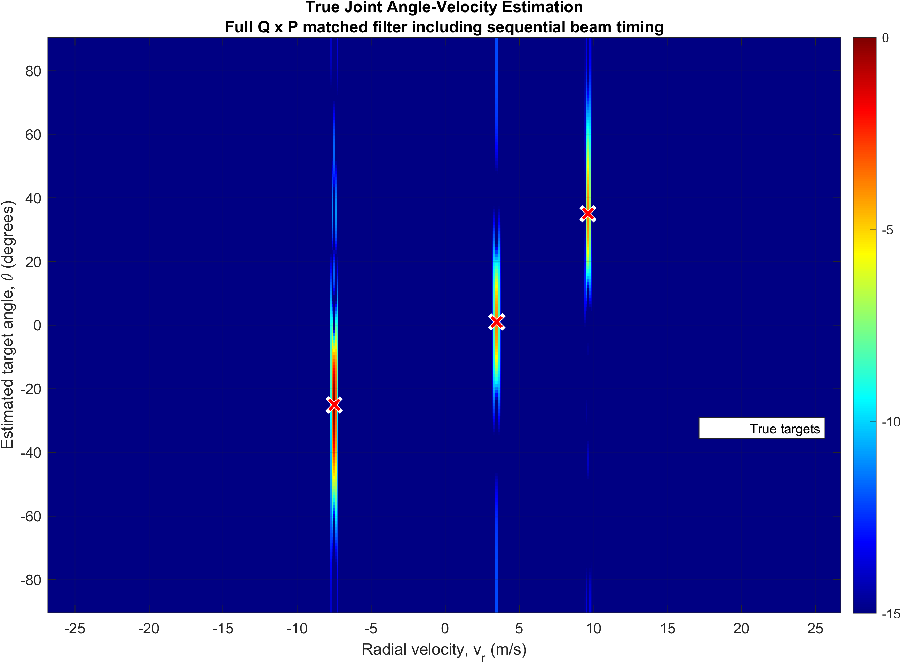
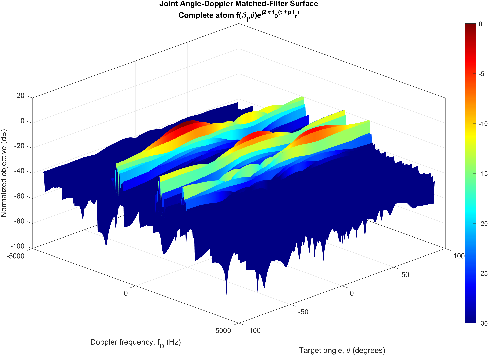

# Single-RF-Chain Beam-Sweeping Radar

MATLAB implementation of a single-RF-chain beam-sweeping radar for joint angle-Doppler estimation, where the conventional array steering vector is replaced by the beam-steering response for angle estimation.

---

## System Overview

  

The beam-steering response explicitly models the complex gain of the analog beamformer in each steering direction. Joint angle-Doppler estimation is then performed using a matched filter that coherently combines all beam-pulse measurements while accounting for the sequential beam acquisition times.

---

## Example Results

  

  

